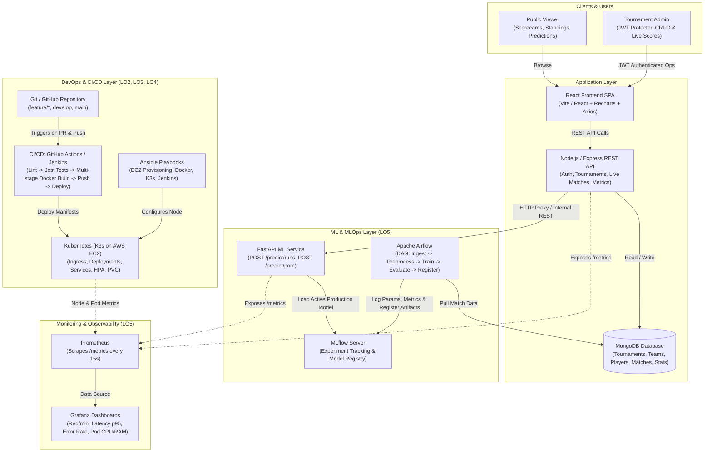
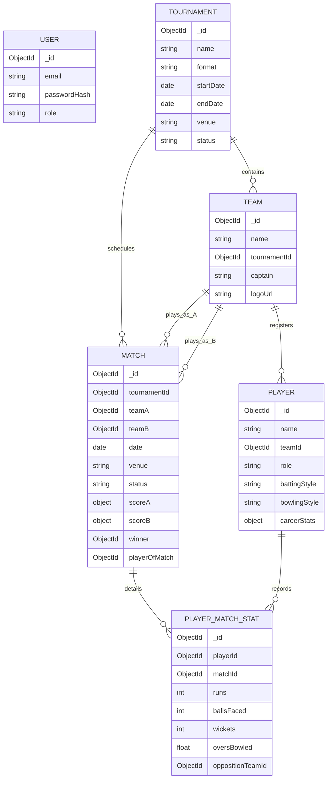
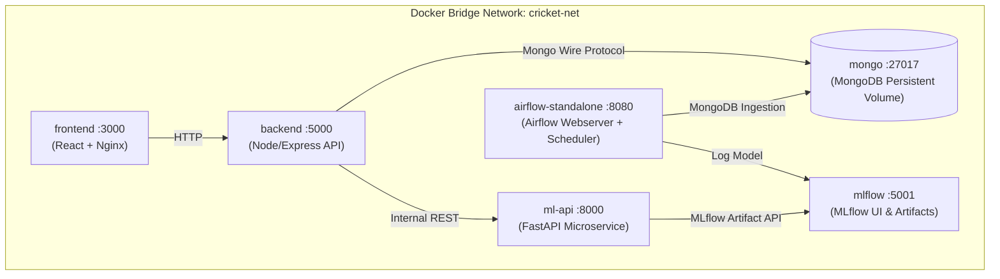
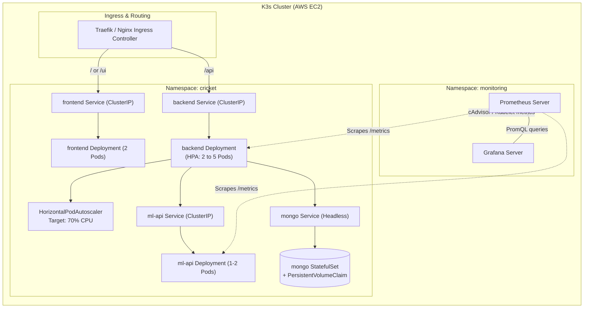

# ARCHITECTURE: Smart Cricket Tournament Tracker

**Course:** Agile Software Development and DevOps Lab (TE AI & DS, Sem V)
**Institution:** Thadomal Shahani Engineering College
**Version:** 1.0

---

## 1. Architecture Overview

The system is organized into four core layers:

1. **Application Layer:** MERN app (React with Recharts, Node.js/Express REST API, MongoDB)
2. **Machine Learning & MLOps Layer (LO5):** Python FastAPI prediction microservice, Scikit-learn models, MLflow (tracking + model registry), Apache Airflow (scheduled retraining DAG)
3. **Platform & Orchestration Layer (LO4):** Docker (multi-stage builds), Docker Compose (local development stack), Kubernetes (K3s lightweight cluster on AWS EC2)
4. **DevOps & Observability Layer (LO1, LO2, LO3, LO5):** Git & GitHub, Jira Scrum board, CI/CD with Jenkins and GitHub Actions, Ansible for IaC & configuration management, Prometheus & Grafana for metrics and dashboards

---

## 2. High-Level System Architecture Diagram

---

## 3. Component Details

### 3.1 Frontend (React SPA)
- **Role:** Interactive public views and administrative scoring console.
- **Key Views:**
  - `Login / Register`: Admin JWT authentication.
  - `Tournament Explorer`: Tournament lists, format, dates, venues.
  - `Live Match Center`: Auto-refreshing scorecard (polling/WebSocket), overs, run rate, required run rate.
  - `Standings Table`: Real-time computed points table with Net Run Rate (NRR).
  - `Player Profile & Form`: Career stats with Recharts interactive line/bar visualization showing last $N$ matches form and ML expected runs.
  - `Admin Control Panel`: CRUD for Tournaments, Teams, Players, Matches, and Live Ball/Over scoring.
- **Production Delivery:** Multi-stage Docker build served via Nginx with reverse proxy configs and caching headers.

### 3.2 Backend (Node.js + Express API)
- **Architecture:** Layered pattern: `Routes` $\rightarrow$ `Controllers` $\rightarrow$ `Services` $\rightarrow$ `Mongoose Models`.
- **Middleware:**
  - `authMiddleware`: JWT verification, claims decoding (`admin` vs `public`).
  - `validateRequest`: Joi/express-validator schemas.
  - `errorHandler`: Centralized error handling with structured JSON responses.
  - `requestLogger`: Winston/Morgan HTTP request logging.
  - `metricsMiddleware`: Prometheus `prom-client` collecting response latencies, HTTP status codes, and throughput.
- **ML Integration:** Internal HTTP client (Axios) querying the FastAPI microservice at `http://ml-api:8000`.
- **Testing:** Jest + Supertest covering unit and integration testing (>70% target coverage).

### 3.3 Database (MongoDB)
- Schema Collections: `users`, `tournaments`, `teams`, `players`, `matches`, `playerMatchStats`.
- Relational mapping via MongoDB `ObjectId` references and indexed queries for fast lookups.
- Aggregation pipelines to compute Net Run Rate (NRR) and player historical form metrics on-the-fly.

### 3.4 ML Service (Python + FastAPI)
- **Role:** High-performance, low-latency microservice for cricket performance and outcome predictions.
- **Endpoints:**
  - `POST /predict/runs`: Predicts expected runs for a player in a specific upcoming match.
  - `POST /predict/pom`: Predicts Player of the Match probability.
  - `GET /health`: Liveness and readiness probe.
  - `GET /metrics`: Prometheus metric endpoint.
- **Feature Engineering:**
  - Recent form ($5$-match rolling average, strike rate).
  - Opposition strength (composite bowling average against player's batting style).
  - Venue batting index (venue historical runs per over).
  - Player role and batting position.
- **Models:** Scikit-learn Random Forest Regressor & Gradient Boosting Classifier.

### 3.5 MLOps Layer (LO5: MLflow + Apache Airflow)
- **MLflow:**
  - Experiment Tracking: logs hyperparameter combinations, training durations, MAE, RMSE, ROC-AUC, and feature importances.
  - Model Registry: Versioned model artifacts (`runs:/<run_id>/model`) tagged with stages (`Staging`, `Production`).
- **Apache Airflow:**
  - Scheduled DAG `cricket_model_retrain_dag` running on a weekly cron schedule (`0 2 * * 0`).
  - Tasks:
    1. `extract_mongo_data`: Export recent completed matches & player stats from MongoDB.
    2. `merge_kaggle_dataset`: Concatenate Kaggle T20 baseline with new live tournament data.
    3. `feature_engineering`: Compute rolling features and target variables.
    4. `train_evaluate_mlflow`: Train candidates, record run in MLflow.
    5. `conditional_promotion`: Compare candidate model MAE against current production model. If MAE is lower, transition new model to `Production`.
    6. `reload_fastapi_model`: Trigger zero-downtime model reload endpoint on FastAPI.

---

## 4. Container Architecture (Docker Compose Local Stack)

- **Multi-Stage Dockerfiles:**
  - Stage 1: Build dependencies and transpile / bundle assets.
  - Stage 2: Minimal runtime image (Alpine/Slim base) running as non-root user (`USER node` or `USER appuser`).
- **Volumes:** Named volumes for MongoDB data (`mongo_data`) and MLflow models (`mlflow_artifacts`).

---

## 5. Kubernetes Architecture (K3s on AWS EC2)

---

## 6. Infrastructure Provisioning (Ansible & AWS EC2)

- **Target Instance:** AWS EC2 `t3.medium` running Ubuntu 22.04 LTS.
- **Ansible Playbook Structure (`ansible/`):**
  - `playbook.yml`: Main orchestrator.
  - `inventory.ini`: EC2 Public IP and SSH private key path.
  - `roles/common`: System updates, security baselines, firewall (UFW).
  - `roles/docker`: Docker engine, containerd, and Docker Compose v2.
  - `roles/jenkins`: OpenJDK 17, Jenkins LTS, initial credentials.
  - `roles/k3s`: Lightweight single-node K3s installation, kubeconfig export.
  - `roles/monitoring`: Helm install of Prometheus & Grafana stack.

---

## 7. CI/CD Architecture (Jenkins & GitHub Actions)

Dual-engine CI/CD design supporting both Jenkins (Experiment 5/7) and GitHub Actions:

```mermaid
flowchart LR
    Dev[Developer] -->|git push branch| GH[GitHub Repository]
    GH -->|Webhook / Actions Trigger| CI{CI Runner:<br/>GitHub Actions / Jenkins}
    
    subgraph CI_Pipeline["CI Pipeline (Pull Request)"]
        C1[1. Checkout Code]
        C2[2. Lint: ESLint & Flake8]
        C3[3. Unit Tests: Jest & Pytest]
        C4[4. Security Audit: npm audit / trivy]
        C5[5. Docker Multi-stage Build Test]
    end

    CI --> C1 --> C2 --> C3 --> C4 --> C5
    C5 -->|Pass / Fail Report| PR[GitHub PR Status Check]

    PR -->|Merge to main| CD{CD Pipeline}

    subgraph CD_Pipeline["CD Pipeline (Merge to Main)"]
        D1[1. Docker Build & Tag commit-SHA]
        D2[2. Push to Docker Hub / GHCR]
        D3[3. Deploy: kubectl apply -f k8s/]
        D4[4. Rollout Verification & Healthcheck]
    end

    CD --> D1 --> D2 --> D3 --> D4 --> LIVE[Live System on AWS EC2]
```

---

## 8. Monitoring & Observability Architecture

- **Instrumentation:**
  - Node.js backend uses `prom-client` exposing `/metrics`.
  - FastAPI ML microservice uses `prometheus-fastapi-instrumentator`.
- **Metrics Collected:**
  - Throughput: `rate(http_requests_total[1m])`
  - Latency: `histogram_quantile(0.95, sum(rate(http_request_duration_seconds_bucket[5m])) by (le))`
  - Failure Rate: `sum(rate(http_requests_total{status=~"5.."}[1m])) / sum(rate(http_requests_total[1m]))`
  - Pod Resources: `container_cpu_usage_seconds_total`, `container_memory_working_set_bytes`
  - ML Model Latency & Prediction counters.

---

## 9. Technology to Lab Experiment Traceability Matrix

| Lab Experiment | Title & Focus | Architecture Realization |
|----------------|---------------|--------------------------|
| **Exp 1** | Version control using Git | Git branching model (`main`, `develop`, `feature/*`), PR workflows, Conventional Commits |
| **Exp 2** | Containerize applications with Docker | Multi-stage Dockerfiles (`frontend/Dockerfile`, `backend/Dockerfile`, `ml-service/Dockerfile`) |
| **Exp 3** | Multi-service apps with Docker Compose | `docker-compose.yml` linking React, Express, MongoDB, FastAPI, MLflow, and Airflow |
| **Exp 4** | Container orchestration using Kubernetes | K3s manifests (`k8s/`): Deployments, Services, ConfigMaps, Secrets, PVC, and HPA |
| **Exp 5** | Continuous Integration (Jenkins / GitHub Actions) | PR build pipelines executing linters, automated unit tests, and image building |
| **Exp 6** | Provisioning and configuration with Ansible | `ansible/playbook.yml` automated provisioning of AWS EC2 with Docker, K3s, and dependencies |
| **Exp 7** | Continuous Delivery / Automated Deployment | Automated deployment triggers on merge to `main`, container registry push, and `kubectl rollout` |
| **Exp 8** | Application & Infrastructure Monitoring | Prometheus scraping `/metrics` + preconfigured Grafana dashboards for cluster & app health |
| **Exp 9** | Agile lifecycle using Jira with DevOps integration | Jira Scrum board, Sprint planning, user stories, ticket keys (`CRIC-XX`) tied to Git branches & commits |
| **Exp 10**| End-to-end DevOps mini-project execution | Complete lifecycle demonstration: Jira issue $\rightarrow$ Feature branch $\rightarrow$ Automated CI $\rightarrow$ CD $\rightarrow$ Live cluster $\rightarrow$ Grafana |
| **Exp 11-12**| Theory Assignments 1 & 2 | Comprehensive documentation (`PRD.md`, `ARCHITECTURE.md`, `WORKFLOW.md`, and report writeups) |
