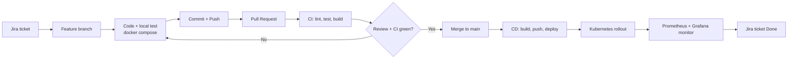
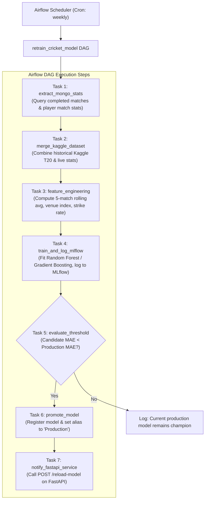

# WORKFLOW: Smart Cricket Tournament Tracker

**Course:** Agile Software Development and DevOps Lab (TE AI & DS, Sem V)
**Institution:** Thadomal Shahani Engineering College
**Version:** 1.0

---

## 1. End-to-End Lifecycle



---

## 2. Agile Workflow (Jira, Experiment 9)

### 2.1 Structure
- **Epics:** Auth, Tournament Management, Live Scoring, Player Stats, ML Service & MLOps, DevOps Pipeline, Monitoring.
- **Stories:** "As an admin, I can create a tournament so that..."
- **Tasks / Bugs** are sub-items of stories.
- Ticket keys look like `CRIC-12`.

### 2.2 Board Columns
`Backlog -> To Do -> In Progress -> In Review -> Testing -> Done`

### 2.3 Sprint Ceremonies (2-week sprints)
| Ceremony | When | Output |
|----------|------|--------|
| Sprint planning | Day 1 | Sprint backlog, story points estimation |
| Daily standup | Daily (15 min) | What was done, what is next, blockers |
| Sprint review | Last day | Demo of the working increment |
| Retrospective | Last day | What went well, what can be improved, action items |

### 2.4 Jira and GitHub Integration
- The branch name and commit messages carry the ticket key (e.g., `feature/CRIC-12-auth`).
- Jira development panel displays branches, commits, PRs, and build status.
- GitHub webhook automatically transitions tickets (e.g., PR open $\rightarrow$ "In Review", PR merge $\rightarrow$ "Done").

### 2.5 Definition of Done (DoD)
- Code written and peer-reviewed.
- Unit and integration tests passing (>70% coverage).
- Automated CI pipeline green on GitHub Actions / Jenkins.
- Container image built and deployed to K3s cluster.
- Grafana confirms system health; Jira ticket closed with release notes.

---

## 3. Git Workflow (Experiment 1)

### 3.1 Branching Strategy
```
main             <- production, protected, auto-deploys via CD
 └── develop     <- integration branch, staging deploy
      ├── feature/CRIC-12-jwt-auth
      ├── feature/CRIC-20-fastapi-ml
      ├── feature/CRIC-31-live-scorecard-ui
      ├── feature/CRIC-42-airflow-retrain-dag
      └── bugfix/CRIC-55-nrr-calculation
```
Hotfixes branch directly from `main` as `hotfix/CRIC-xx-desc`.

### 3.2 Commit Convention
Format: `<type>(<scope>): <message> [CRIC-XX]`

Types: `feat`, `fix`, `docs`, `test`, `chore`, `ci`, `refactor`, `perf`.

Example: `feat(auth): add JWT login endpoint and bcrypt hashing [CRIC-12]`

### 3.3 Protection Rules
- Direct pushes to `main` and `develop` are strictly blocked.
- Pull requests require at least 1 approving review and green CI checks.
- Squash and merge into `develop`; merge commit from `develop` into `main`.

### 3.4 Developer Daily Commands
```bash
git checkout develop && git pull origin develop
git checkout -b feature/CRIC-12-jwt-auth
# Make code edits, run local tests
git add .
git commit -m "feat(auth): add JWT login endpoint [CRIC-12]"
git push -u origin feature/CRIC-12-jwt-auth
# Open PR on GitHub -> base: develop
```

---

## 4. Local Development Workflow (Experiments 2 and 3)

```bash
git clone <repo-url> && cd cricket-tracker
cp .env.example .env
docker compose up --build        # frontend, backend, ml-api, mongo, mlflow, airflow
```

| Service | Port / URL | Description |
|---------|------------|-------------|
| Frontend | `http://localhost:3000` | React web application |
| Backend API | `http://localhost:5000` | Express REST API |
| Backend Metrics | `http://localhost:5000/metrics` | Prometheus metrics |
| ML API Docs | `http://localhost:8000/docs` | FastAPI Swagger / OpenAPI docs |
| MLflow UI | `http://localhost:5001` | Model registry & experiment tracking |
| Airflow Web UI | `http://localhost:8080` | DAG orchestration & retraining scheduler |
| MongoDB | `localhost:27017` | Database engine |

Run backend tests locally:
```bash
cd backend && npm test
```

---

## 5. CI Workflow (Experiment 5: Jenkins & GitHub Actions)

**Trigger:** PR opened or updated against `develop` or `main`.

| Stage | Action | Tooling |
|-------|--------|---------|
| 1. Checkout | Shallow clone of the PR branch | Git |
| 2. Dependency Install | `npm ci` (backend & frontend), `pip install -r requirements.txt` (ml-service) | npm, pip |
| 3. Lint & Format | Code style enforcement | ESLint, Prettier, Flake8 |
| 4. Automated Tests | Unit and route tests with coverage reporting | Jest, Supertest, Pytest |
| 5. Security Scan | Scan for vulnerabilities | `npm audit`, `trivy` container scan |
| 6. Container Build | Multi-stage Docker test build for all microservices | Docker BuildKit |
| 7. PR Reporting | Status check posted to GitHub PR conversation | GitHub Status API |

Both **Jenkinsfile** (Declarative Pipeline) and **GitHub Actions Workflow** (`.github/workflows/ci.yml`) are supported.

---

## 6. CD Workflow (Experiment 7: Automated Deployment)

**Trigger:** Merge to `main`.

| Stage | Action | Command / Mechanism |
|-------|--------|---------------------|
| 1. Version Tagging | Extract git commit short SHA | `TAG=$(git rev-parse --short HEAD)` |
| 2. Image Build | Build production images | `docker build -t $REGISTRY/cricket-backend:$TAG backend/` |
| 3. Registry Push | Push images to Docker Hub / GHCR | `docker push $REGISTRY/cricket-backend:$TAG` |
| 4. Cluster Deploy | Update deployments on K3s | `kubectl apply -f k8s/` or `kubectl set image ...` |
| 5. Rollout Verification | Ensure zero-downtime rolling update completes | `kubectl rollout status deployment/backend -n cricket` |
| 6. Rollback (on failure) | Automated revert if health checks fail | `kubectl rollout undo deployment/backend -n cricket` |

---

## 7. Infrastructure Workflow (Experiments 4 and 6)

1. **AWS EC2 Provisioning:**
   - Launch Ubuntu 22.04 LTS instance (`t3.medium`).
   - Security Group: Allow ports 22 (SSH), 80/443 (HTTP/S), 8080 (Jenkins), 3000 (App), 9090 (Prometheus), 3001 (Grafana).
2. **Ansible Playbook Execution:**
   - Add EC2 public IP to `ansible/inventory.ini`.
   - Run: `ansible-playbook -i ansible/inventory.ini ansible/playbook.yml`.
   - Automatically provisions Docker, Docker Compose, Jenkins, and K3s single-node cluster.
3. **Cluster Setup:**
   - Fetch kubeconfig: `scp ubuntu@<EC2_IP>:~/.kube/config ~/.kube/k3s-config`.
   - Setup namespaces: `kubectl create ns cricket && kubectl create ns monitoring`.
   - Deploy secrets and apps: `kubectl apply -f k8s/ -n cricket`.
4. **HPA Load Testing:**
   - Run Apache Bench / Hey / k6 to simulate concurrent match viewers:
     ```bash
     hey -n 10000 -c 50 http://<EC2_IP>/api/matches/live
     ```
   - Watch backend autoscale from 2 to 5 pods: `kubectl get hpa -n cricket -w`.

---

## 8. MLOps Workflow (LO5: MLflow + Apache Airflow)



- **Manual Trigger Option:** Run `python ml-service/training/train.py --register` for ad-hoc experimentation.
- **Monitoring Drift:** Feature distribution and MAE tracking visualized inside MLflow UI.

---

## 9. Monitoring Workflow (Experiment 8)

1. Backend Node.js exposes `/metrics` via `prom-client`.
2. FastAPI exposes `/metrics` via `prometheus-fastapi-instrumentator`.
3. Prometheus scrapes both endpoints at 15-second intervals.
4. Grafana imports pre-built dashboards (`monitoring/dashboards/cricket_dashboard.json`).
5. Live demonstration panels:
   - **Throughput:** HTTP requests per second by route.
   - **Latency:** 95th and 99th percentile response times (target < 500ms).
   - **Error Rate:** 4xx and 5xx percentages.
   - **Resource Usage:** Pod CPU and memory utilization against limits.
   - **ML Metrics:** Inference latency and predictions generated counter.

---

## 10. Sprint Plan & Syllabus Mapping

| Sprint | Timeline | Deliverables & Scope | Experiments Mapped |
|--------|----------|----------------------|--------------------|
| **Sprint 0** | Week 1 | Git repo initialization, Jira Scrum board setup, MongoDB schema definitions, API contracts, UI wireframes | Exp 1, Exp 9 |
| **Sprint 1** | Weeks 2-3 | Backend Node/Express API, JWT auth, MongoDB models, CRUD routes, Jest unit tests | Exp 1, Exp 5 |
| **Sprint 2** | Weeks 4-5 | React frontend, Live Scorecard polling, Standings table calculation, Recharts player form | Exp 1, Exp 2 |
| **Sprint 3** | Weeks 6-7 | Kaggle dataset preprocessing, ML models, FastAPI microservice, MLflow tracking, Node proxy | Exp 2, LO5 |
| **Sprint 4** | Weeks 8-9 | Multi-stage Dockerfiles, Docker Compose stack, Ansible EC2 provisioning, Jenkins / GitHub Actions CI | Exp 2, Exp 3, Exp 5, Exp 6 |
| **Sprint 5** | Weeks 10-11 | K3s Kubernetes manifests, HPA, CD pipeline to cluster, Prometheus & Grafana monitoring, Airflow DAG | Exp 4, Exp 7, Exp 8, LO5 |
| **Sprint 6** | Week 12 | End-to-end integration testing, chaos/load testing, documentation, final demo rehearsal | Exp 10, Exp 11, Exp 12 |

---

## 11. Final Demo Script (Experiment 10)

1. **Jira:** Open Jira board, view Sprint backlog, pick ticket `CRIC-99` ("Add bowler economy rate graph"). Move to "In Progress".
2. **Git & Feature Branch:** Create `feature/CRIC-99-economy-chart`, commit changes using conventional commits (`feat(ui): add bowler economy chart [CRIC-99]`), push to GitHub.
3. **CI Pipeline:** Open PR against `develop`. Show automated CI pipeline (lint, unit tests, Docker build) passing with green check.
4. **CD & Rollout:** Merge PR to `main`. Show automated CD deploying updated image to K3s cluster (`kubectl rollout status`).
5. **Live Verification:** Open live web app on EC2 IP, showcase the newly deployed chart and live scorecard updates.
6. **Autoscaling & Monitoring:** Execute load test (`hey`), observe Grafana dashboard spikes in request rate, and watch Kubernetes HPA scale pods dynamically (`kubectl get pods -l app=backend`).
7. **MLOps Validation:** Open MLflow dashboard showing logged experiment metrics, and open Airflow UI showing successful scheduled retraining DAG run.
8. **Jira:** Close `CRIC-99` moving it to "Done".